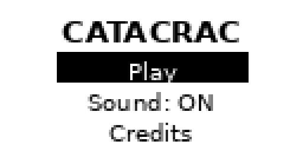

# Catacrac

A [Flipper Zero](https://flipperzero.one/) app that helps a kid learn
Catalan vocabulary. It shows a full-screen animal icon, asks *"Que es?"*
("What is it?"), and reveals the word underneath on request — a small
flashcard game built for the Flipper's black-and-white 128x64 screen.

<p>
  
  
</p>
<p>
  
</p>

## Features

- **12 animal words** in Catalan, each with its own full-screen icon and a small bounce animation
- **Guess-first flashcard flow**: the word stays hidden until you press OK
- **Sound feedback** — a tick on navigation, a rising chime on reveal — via the Flipper's piezo speaker, toggleable from the menu
- **Kid-proof exit**: leaving Play mode requires a long press of Back, so a stray tap won't end the session
- Icons sourced from [OpenMoji](https://openmoji.org) (CC BY-SA 4.0), not hand-drawn — see [Icons](#icons) below

## Controls

| Screen | Button | Action |
|---|---|---|
| Menu | Up / Down | Move selection |
| Menu | OK | Select (Play / toggle Sound / Credits) |
| Menu | Back | Exit the app |
| Play | Left / Right | Previous / next word |
| Play | OK | Reveal the word, or repeat the animation once revealed |
| Play | Back (long press) | Return to the menu |
| Credits | Back | Return to the menu |

## Build

Uses [ufbt](https://github.com/flipperdevices/flipperzero-ufbt), the
lightweight Flipper build tool (no full firmware checkout needed).

```
pip install ufbt
ufbt          # build the .fap
ufbt launch   # build, install and launch on a connected Flipper over USB
```

## Install permanently on the Flipper

`ufbt launch` doesn't just run the app temporarily — it copies the build
to the device's SD card at `/ext/apps/Games/catacrac.fap`. That's a
normal permanent install: it survives unplugging and reboots, and shows
up under the Flipper's own **Main Menu → Apps → Games → Catacrac**, so
it can be opened directly from the device without a computer.

To push a fresh build after making changes, just run `ufbt launch`
again — it rebuilds, re-installs over the old copy, and starts it. If
the app is already running on the device, closing it remotely can fail
with `Application ... has to be closed manually`: in Play mode this
needs a long press of Back (see [Controls](#controls)), from the menu a
normal Back works. Once it's closed, retry `ufbt launch`.

## Icons

Icon frames live under `images/<animal>/` (`frame_0.png`, `frame_1.png`,
`frame_rate`) and are compiled into the app through Flipper's standard
`fap_icon_assets` pipeline — nothing hand-rolled. They're generated by
`tools/fetch_openmoji_frames.py`, which renders [OpenMoji](https://openmoji.org)'s
black-outline emoji SVGs (CC BY-SA 4.0, credited on the in-app Credits
screen) and thresholds them to 1-bit. Regenerate with:

```
.venv/bin/python tools/fetch_openmoji_frames.py   # needs cairosvg + network access
```

The two-frame "animation" is a small 2px vertical bounce, applied
uniformly to every icon.

## Project structure

```
application.fam               Flipper app manifest
catacrac.c                    App source (menu, play, credits screens)
u8g2_font_helvb18_tr.c        Vendored bold 18px font (u8g2), used for the word text
catacrac_10px.png             App-list icon
images/<animal>/              Per-word icon frames (generated, see above)
tools/fetch_openmoji_frames.py  Icon generation script
docs/                          README screenshots
```

## Known limitations

- Word list is hardcoded in `catacrac.c`, not loaded from the SD card
- Catalan diacritics (ratolí, lleó, ànec) aren't in the word list yet —
  Flipper's stock `FontSecondary` doesn't render accents (confirmed on
  device), and the vendored word font hasn't been tested with them
- Only Catalan is supported; no Spanish/other-language toggle
- The piezo speaker plays simple reinforcement tones only — the Flipper
  can't play real recorded pronunciation

## Possible extensions

- Quiz mode: show the icon, pick the right word from two options
- Track which words have already been seen
- Load word packs from the SD card instead of hardcoding the list
